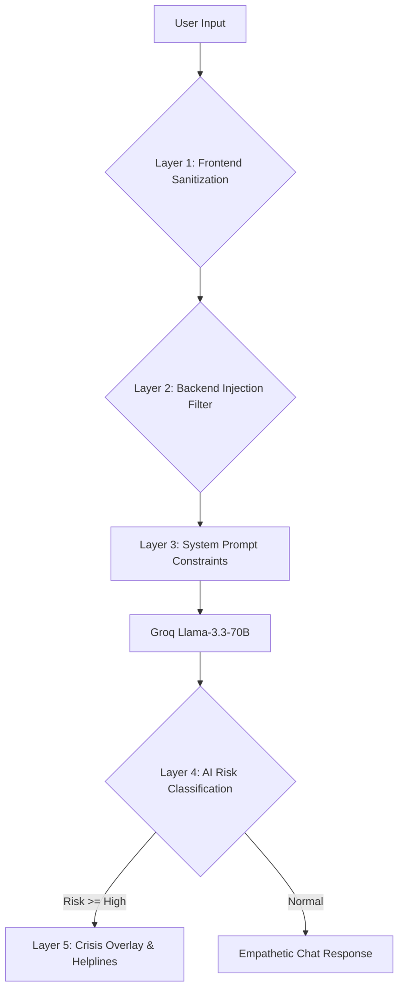

# 🌸 Manasitra — Mann Ka Mitra

> **"Friend of the Mind"** — A premium, multilingual AI emotional companion designed specifically for Indian students.

[](https://vitejs.dev/)
[](https://reactjs.org/)
[](https://tailwindcss.com/)
[](https://capacitorjs.com/)
[](https://www.electronjs.org/)

---

## 🌟 Overview

Manasitra is a **privacy-first, culturally-aware** mental wellness platform built for the unique challenges faced by students in India. From exam stress and hostel life to family expectations, Manasitra provides empathetic AI support in **10 Indian languages**, coupled with a suite of **offline calming tools** and a gamified growth system called the **Soul Garden**.

### 🚀 Why Manasitra?
- **Zero Privacy Compromise:** All your data (mood logs, streaks, personal notes) stays locally on your device. Nothing is stored on our servers.
- **Cultural Resonance:** AI responses are tuned to understand Indian student life, using familiar terms like *"Dost"* and *"Yaar"*.
- **Multilingual Support:** Communicate fluently in English, Hindi, Gujarati, Marathi, Bengali, Tamil, Telugu, Kannada, Malayalam, or Punjabi.
- **Resilience Focused:** We don't just track moods; we help you grow a literal garden of resilience through positive actions.

---

## ✨ Primary Features

| Feature | Description | Tech Highlight |
|:---|:---|:---|
| 🤖 **Empathetic AI Chat** | Real-time emotional support with risk-aware responses. | LLama-3.3-70B via Groq |
| 🌱 **Soul Garden** | A gamified resilience tracker where your virtual tree grows as you heal. | Framer Motion & SVG |
| 😊 **Deep Mood Tracking** | 7-state emotional check-ins with trends and daily win logs. | Recharts & IndexedDB |
| 📊 **Progress Dashboard** | Visualise your mental wellness journey with streak tracking. | Zustand & localforage |
| 🧘 **10 Calming Tools** | Fully offline tools: Breathing, Grounding, Focus Puzzles, and more. | Canvas API |
| 🆘 **Safety First** | Multi-layer crisis detection with instant helpline foregrounding. | Regex + AI Logic |
| 🌐 **10 Languages** | Seamless UI & AI transitions across major Indian scripts. | i18next |
| 🔒 **Privacy Audit** | Transparency view of every single byte stored on your device. | Audit Engine |

---

## 🌱 Soul Garden: The Resilience Engine

The Soul Garden represents your mental strength. Unlike traditional charts, your progress is visualized as a growing **Banyan Tree**.

### 📈 Growth Evolution
1.  🌰 **Seed (Beej):** The beginning of your mindfulness journey. (0 XP)
2.  🌿 **Sprout (Ankur):** Your first steps towards healing. (20 XP)
3.  🪴 **Sapling (Paudha):** Forming strong roots and healthy habits. (60 XP)
4.  🌳 **Tree (Ped):** Standing tall against academic and life stress. (130 XP)
5.  🌲 **Banyan Tree (Bargad):** The ultimate symbol of Indian resilience. (250 XP)

### ⚡ How to Level Up
- **Chat with AI:** +2 XP
- **Daily Mood Check-in:** +5 XP
- **Use a Calming Tool:** +8 XP
- **Log a Daily Win:** +6 XP

---

## 🛠️ Hybrid Tech Stack

Manasitra is built for high performance across Web, Mobile, and Desktop.

### **Frontend Architecture**
- **Core:** React 19 + Vite 8
- **Styling:** Tailwind CSS 4 (Custom Variable System)
- **Animation:** Framer Motion (Optimized for low-end hardware)
- **State:** Zustand (Atomic state management)
- **Charts:** Recharts (High-precision data visualization)
- **Runtime:** Capacitor (Native Android) / Electron (Desktop App)

### **Backend & AI Logic**
- **Server:** Node.js + Express 5 (Stateless Architecture)
- **Model:** llama-3.3-70b-versatile (via Groq Cloud)
- **Safety:** Custom Regex + Structured JSON schema enforcement
- **API:** RESTful endpoints with strictly enforced rate limits

---

## 🚀 Quick Start Guide

### 1️⃣ Clone and Install
```bash
git clone https://github.com/yash17242826/veeza.git
cd Manasitra
npm install
```

### 2️⃣ Environment Configuration
Create a `.env` file in the `backend` folder:
```env
GROQ_API_KEY=your_groq_key_here
PORT=3001
```

### 3️⃣ Running the Application

| Environment | Command | Location |
|:---|:---|:---|
| **Backend** | `npm run dev` | `backend/` |
| **Web App** | `npm run dev` | `manasitra-web/` |
| **Desktop** | `npm run dev` | root folder |
| **Android** | `npx cap run android` | `manasitra-web/` |

---

## 🔐 Safety & Privacy Matrix

We believe your mental health data is sacred.

| Data Type | Storage Implementation | Retention Policy |
|:---|:---|:---|
| **Chat History** | `sessionStorage` (Memory only) | Deleted on Tab Close |
| **Mood Logs** | `IndexedDB` (Encrypted hint) | Device Only (Persistent) |
| **XP & Growth** | `localStorage` | Device Only (Persistent) |
| **AI Context** | Statless API Request | Never Logged Server-side |

> [!IMPORTANT]
> **Crisis Detection:** If a "High" or "Critical" risk is detected in AI conversation, the app automatically triggers a safety overlay and presents verified Indian helplines (iCall, Vandrevala, AASRA).

---

## 🛡️ Safety Architecture: The 5-Layer Shield

Manasitra uses a multi-layered approach to ensure user safety during emotional distress.




---

## 🕊️ Calming Tools Suite
Accessible via the `/games` route, these tools are designed for immediate relief.
- **Breathing Bubble:** 4-7-8 rhythm guide.
- **Tap to Calm:** High-feedback stress release.
- **Grounding Guide:** 5-4-3-2-1 sensory walkthrough.
- **Mood Canvas:** Freehand emotional expression.
- **Gratitude Jar:** Daily positive affirmation log.

---

## 🏆 Acknowledgements
Built with profound care for **Ideathon Viksit Bharat 2047** at **Silver Oak University**.

---
<p align="center">
  <i>"Hamesha yaad rakhna, aap akele nahi hain."</i><br>
  <b>Built with ❤️ to heal one mind at a time.</b>
</p>
